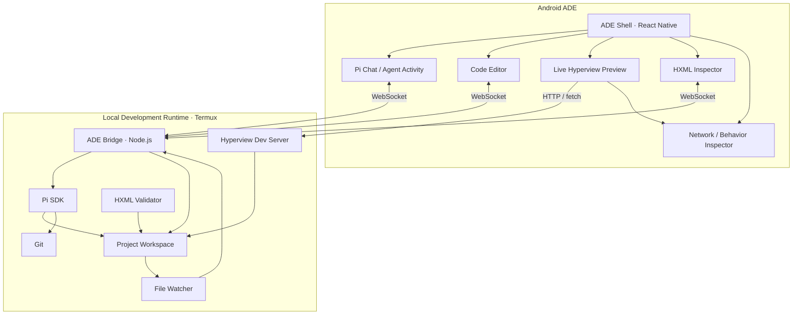
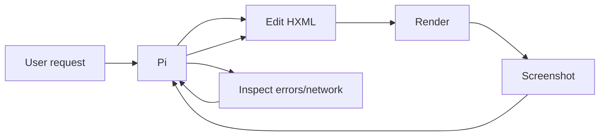

Yes. I think **Pi + Hyperview is unusually well suited to an Android-first ADE**.

I would frame the product as:

> **“Cursor/Claude Code + browser DevTools, but for native Hyperview apps, running on the phone you are building for.”**

The important part is that the **ADE itself is a React Native app containing a real Hyperview renderer**. You are not emulating the target application in a WebView—the preview is actually rendered through Hyperview's native React Native client. Hyperview explicitly supports embedding its renderer inside an existing React Native application. ([GitHub][1])

## Architecture I would use



### Why I would split it this way

The React Native app should **not try to import the complete Pi coding SDK into Hermes**. Pi's coding environment is Node-oriented: its standard tools use filesystem APIs, processes, shells and things such as `node:fs` and `child_process`. ([GitHub][2])

But the excellent news is that **Pi officially supports Android through Termux**. The current documented setup installs Node.js, Git and Pi directly in Termux. ([Pi][3])

So instead of fighting Android, we exploit it:

```text
Android APK
     │
     │ localhost websocket/http
     ▼
Termux
  └── Node
       └── our ADE daemon
            └── Pi SDK
```

And today you should use the new package name:

```bash
@earendil-works/pi-coding-agent
```

Pi moved from the old `@mariozechner` scope in May 2026. ([Pi][4])

---

# The really cool part: Hyperview becomes our browser

Hyperview normally works like this:

```text
GET /home
     ↓
   HXML
     ↓
Hyperview Client
     ↓
Native Android UI
```

HXML describes native screens and behavior, while the React Native Hyperview client renders them. ([Hyperview][5])

Our ADE simply embeds that client.

So imagine the phone in landscape:

```text
┌────────────────────────────────────────────────────────────┐
│ Project: todo-hyperview                  ● DEV   Pixel 9   │
├──────────────────────┬─────────────────────────────────────┤
│                      │                                     │
│ PI                   │         LIVE APP                    │
│                      │                                     │
│ > Make the add       │    ┌─────────────────────┐          │
│   button floating    │    │ Todo                │          │
│                      │    │                     │          │
│ ● reading home.xml   │    │ ○ Buy milk         │          │
│ ● editing styles     │    │ ○ Book flight      │          │
│ ✓ changed 8 lines    │    │                     │          │
│                      │    │              [ + ]  │          │
├──────────────────────┴────┴─────────────────────┴──────────┤
│ Editor     Preview     Inspector     Network     Terminal   │
└────────────────────────────────────────────────────────────┘
```

Pi edits:

```text
screens/home.xml
```

The daemon sees the change.

```text
home.xml changed
       ↓
preview.invalidate
       ↓
Hyperview refetch
       ↓
native UI changes
```

No APK rebuild.

No Metro reload.

No emulator.

You literally see Pi's change **on the device Pi is working on**.

That is the killer feature.

---

## We can make debugging much better than ordinary Hyperview development

Hyperview has one architectural feature that makes our ADE possible: **the `fetch` implementation is injected into the Hyperview component**. ([Hyperview][6])

Instead of:

```tsx
<Hyperview
  entrypointUrl={url}
  fetch={fetch}
/>
```

we provide:

```tsx
<Hyperview
  entrypointUrl={url}
  fetch={adeFetch}
/>
```

`adeFetch()` becomes our equivalent of Chrome's Network panel.

We can record:

```text
14:03:12 GET  /home.xml        200  17ms
14:03:16 POST /todos           200  31ms
14:03:16 GET  /todos/fragment  200  13ms
```

Tap one and see:

```text
REQUEST

POST /todos

title=Buy+milk
priority=normal


RESPONSE

<view id="todo-42">
    <text>Buy milk</text>
</view>
```

This is especially powerful because Hyperview behavior is fundamentally request driven: triggers issue HXML requests and actions such as `push`, `replace`, `append`, `prepend`, etc. operate on the response. ([Hyperview][7])

So our debugger could visually show:

```text
PRESS
  ↓
POST /todo/create
  ↓
200 OK · 13ms
  ↓
action="append"
  ↓
target="#todo-list"
```

That's essentially **Hypermedia DevTools**.

---

# And then give Pi access to those DevTools

This is where it becomes an **ADE rather than an AI chat bolted onto an editor**.

I would create Pi-specific tools such as:

```text
preview_state
preview_screenshot
preview_reload

hxml_validate
hxml_inspect

network_requests
network_response

app_logs
app_errors
```

Then Pi can do this autonomously:

```text
User:
The button doesn't do anything.

Pi:
→ network_requests
→ sees no request

→ reads screens/profile.xml
→ discovers trigger="change" instead of trigger="press"

→ edits profile.xml

→ preview_reload

→ preview_screenshot

"The Save button now triggers correctly."
```

And this is supported nicely by Pi's architecture because its SDK explicitly allows custom tools and custom extensions. ([Pi][8])

Even better, Pi prompts can include **images**, so `preview_screenshot` can send the current rendered UI back into the agent's context. ([Pi][8])

That gives us a feedback loop:



This is the bit I find most compelling.

Pi can **see the app it just changed**.

---

# The first version should be deliberately narrow

I would **not** attempt to build Android Studio on Android.

For V0.1 I'd support only:

| Capability                         | V0.1  |
| ---------------------------------- | ----- |
| Pi conversations                   | ✅     |
| Pi streaming/tool activity         | ✅     |
| Project filesystem                 | ✅     |
| HXML editing                       | ✅     |
| XML syntax highlighting            | ✅     |
| Hyperview preview                  | ✅     |
| Automatic refresh                  | ✅     |
| Network inspector                  | ✅     |
| HXML errors                        | ✅     |
| Git diff                           | ✅     |
| Git commits                        | ✅     |
| Terminal command output            | ✅     |
| Screenshot → Pi                    | ✅     |
| Arbitrary React Native development | ❌     |
| Kotlin debugging                   | ❌     |
| Full Android builds                | ❌     |
| LSP ecosystem                      | Later |
| Native breakpoints                 | Later |

The constraint becomes a feature:

> **This is an IDE specifically designed for server-driven Hyperview applications.**

That allows the experience to be dramatically simpler.

---

# Project format

I'd introduce a tiny project manifest.

For example:

```text
my-app/
├── hyperview.json
├── package.json
├── server/
│   └── index.ts
├── screens/
│   ├── index.xml
│   ├── login.xml
│   └── profile.xml
├── components/
│   └── ...
├── assets/
└── .pi/
    ├── AGENTS.md
    ├── skills/
    └── extensions/
```

With:

```json
{
  "name": "My App",
  "entrypoint": "/index.xml",
  "dev": {
    "command": "npm run dev",
    "port": 8085
  }
}
```

The ADE knows:

```text
Start project
       ↓
run npm run dev
       ↓
wait for :8085
       ↓
open /index.xml
       ↓
Hyperview renders
```

Hyperview already follows this backend/client architecture and its official demo uses a local HTTP server on port 8085, so we're not inventing an unnatural development model. ([Hyperview][9])

---

# Editor: don't use Monaco initially

On Android I'd probably choose:

**CodeMirror 6 inside a WebView**.

Not Monaco.

Monaco is wonderful on desktop but relatively heavyweight for a mobile-first editor.

CodeMirror gives us enough to make HXML excellent:

```text
XML syntax highlighting
autocomplete
search
bracket/tag matching
diagnostics
multiple files
keyboard shortcuts
touch selection
```

And then we build **Hyperview-aware completion**.

Typing:

```xml
<view tr
```

could offer:

```text
trigger
```

and:

```xml
trigger="
```

could offer:

```text
press
longPress
pressIn
pressOut
visible
refresh
load
select
deselect
focus
blur
submit
change
on-event
```

Those values come from Hyperview's defined behavior model. ([Hyperview][7])

That would make the editor feel purpose-built instead of generic.

---

# Pi should run as an SDK service, not just `pi --mode rpc`

Pi supports both SDK embedding and RPC mode. RPC is intended for subprocess/language-isolated integration, while the SDK is intended when you control the Node process and want direct session/tool/state access. ([Pi][10])

For us I'd use:

```text
React Native
     │
 WebSocket
     ▼
ade-daemon
     │
 Pi SDK
```

rather than:

```text
React Native → pi --mode rpc
```

because we're going to want custom functionality:

```text
Hyperview tools
preview communication
filesystem events
session state
custom context
screenshots
Git integration
diagnostics
project switching
```

The Pi SDK is the better boundary for that.

---

# One particularly powerful Pi extension

Every Hyperview project could automatically get something like:

```text
.pi/
└── skills/
    └── hyperview/
        └── SKILL.md
```

teaching Pi the Hyperview conventions.

And an extension:

```text
.pi/
└── extensions/
    └── hyperview-dev.ts
```

that exposes:

```text
hyperview_validate
hyperview_preview
hyperview_network
hyperview_screenshot
hyperview_reload
```

Pi automatically supports project-local skills and extensions, making this a very natural integration rather than maintaining a giant custom system prompt. ([Pi][11])

---

# Eventually we could remove the visible editor almost entirely

This is where I think the concept becomes more interesting than simply “VS Code on a phone.”

The primary UI could ultimately be:

```text
┌──────────────────────────────────────┐
│                                      │
│            LIVE APP                  │
│                                      │
│                                      │
├──────────────────────────────────────┤
│                                      │
│ "Make this card smaller and add a    │
│  button to delete the item."         │
│                                      │
│                         [ Send ]      │
└──────────────────────────────────────┘
```

Long-press an element:

```text
┌─────────────────────┐
│ Inspect             │
│ Ask Pi about this   │
│ Edit HXML           │
│ View requests       │
└─────────────────────┘
```

Choose:

```text
Ask Pi about this
```

and Pi receives something conceptually like:

```text
The user selected:

screen: /profile
element: #profile-header
source: screens/profile.xml
line: 43

Attached: current screenshot
```

Then:

> “Move the avatar to the left and make the name larger.”

Pi edits it.

The preview updates.

That is much closer to an **agent-native development environment** than putting a chatbot beside a code editor.

---

## My proposed MVP

I think we should actually build this around **three packages**:

```text
hyper-ade/
├── apps/
│   └── android/             # React Native ADE
│
├── packages/
│   ├── daemon/              # Node + Pi SDK, runs in Termux
│   └── protocol/            # shared TS messages/types
│
└── examples/
    └── hello-hyperview/
```

And our first end-to-end milestone should be extremely specific:

```text
1. Start daemon in Termux
2. Open ADE Android app
3. ADE discovers/connects to localhost daemon
4. Open example Hyperview project
5. Render index.xml natively
6. Open Pi panel
7. Say "Change Hello to Hello Alex"
8. Pi edits index.xml
9. File watcher detects change
10. Hyperview preview refreshes automatically
11. New native UI appears
```

Once **that loop works**, we have the foundation of the entire product.

And I would immediately make milestone #2:

```text
Pi edits UI
→ ADE captures preview
→ screenshot goes back to Pi
→ Pi can visually verify its own work
```

That feedback loop is what can make this genuinely different rather than simply another mobile code editor. ([Pi][8])

I think this concept is strong enough that I'd **avoid generalizing it beyond Hyperview initially**. A very polished “Hyperview Studio powered by Pi” is much more achievable—and much more interesting—than attempting a generic Android IDE from day one.

[1]: https://github.com/instawork/hyperview?utm_source=chatgpt.com "GitHub - Instawork/hyperview: Server-driven mobile apps with React Native · GitHub"
[2]: https://github.com/badlogic/pi-mono/blob/main/packages/coding-agent/src/core/tools/bash.ts?utm_source=chatgpt.com "pi-mono/packages/coding-agent/src/core/tools/bash.ts at main · badlogic/pi-mono · GitHub"
[3]: https://pi.dev/docs/latest/termux?utm_source=chatgpt.com "Termux (Android) Setup · Documentation · Pi"
[4]: https://pi.dev/news/2026/5/7/pi-has-a-new-home?utm_source=chatgpt.com "Pi Has a New Home at Earendil · News · Pi"
[5]: https://hyperview.org/docs/guide_introduction?utm_source=chatgpt.com "Introduction · Hyperview"
[6]: https://hyperview.org/docs/reference_hyperview_component?utm_source=chatgpt.com "Hyperview component · Hyperview"
[7]: https://hyperview.org/docs/reference_behavior_attributes?utm_source=chatgpt.com "Behavior Attributes · Hyperview"
[8]: https://pi.dev/docs/latest/sdk?utm_source=chatgpt.com "SDK · Documentation · Pi"
[9]: https://hyperview.org/docs/guide_installation?utm_source=chatgpt.com "Getting started · Hyperview"
[10]: https://pi.dev/docs/latest/rpc?utm_source=chatgpt.com "RPC Mode · Documentation · Pi"
[11]: https://pi.dev/docs/latest/extensions?utm_source=chatgpt.com "Extensions · Documentation · Pi"
